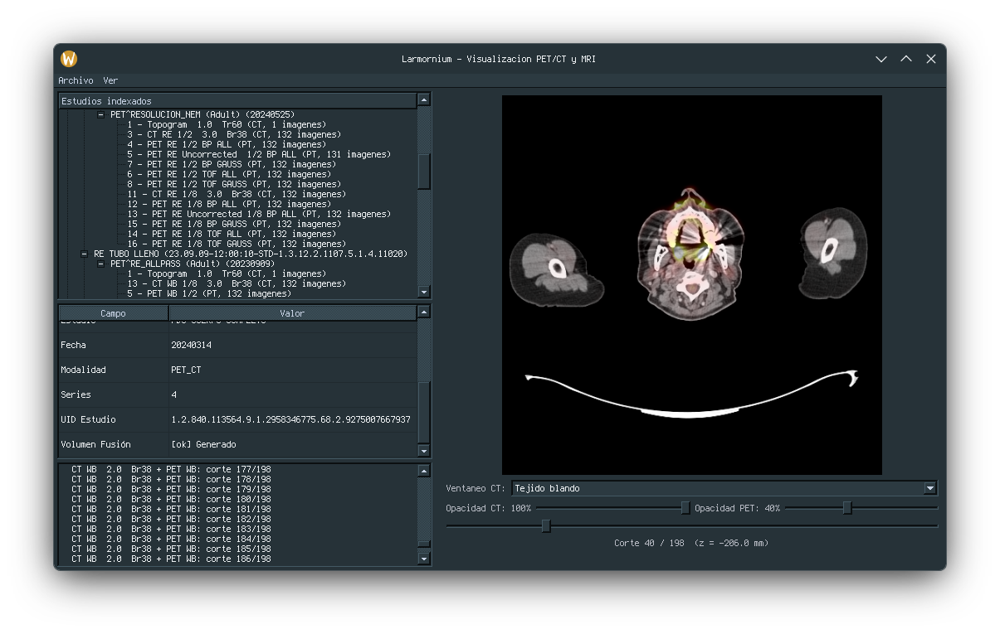

# Larmornium.py

Visualización y análisis de estudios PET/CT y MRI.

## Estructura de Directorios para Indexación

Al seleccionar un directorio para indexar, este debe contener los subdirectorios correspondientes según la modalidad de los estudios:

- **`PET_CT`**: Subdirectorio donde deben ubicarse los estudios PET/CT.
- **`MRI`**: Subdirectorio donde deben ubicarse los estudios de resonancia magnética (MRI).

Ejemplo de estructura requerida en el directorio a seleccionar:

```
directorio_seleccionado/
├── PET_CT/
│   └── ... (carpetas con series y archivos DICOM de PET/CT)
└── MRI/
    └── ... (carpetas con series y archivos DICOM de MRI)
```

Si el directorio no contiene al menos uno de estos subdirectorios (`PET_CT` o `MRI`), los estudios no se indexarán correctamente.

## Instalacion

Requiere Python 3. El script crea un entorno virtual (`venv/`) e instala
las dependencias necesarias.

En Linux y macOS:

```bash
./install_dependencies.sh
```

En Windows:

```bat
install_dependencies_windows.bat
```

## Ejecución

Activar el entorno virtual y lanzar la aplicación:

```bash
source venv/bin/activate      # Windows: venv\Scripts\activate.bat
python3 larmornium.py gui
```

## Funcionamiento de la GUI



